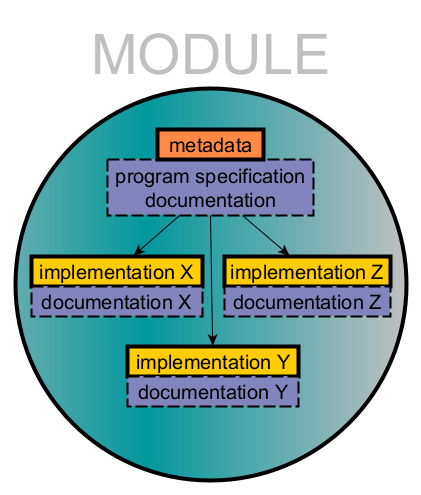
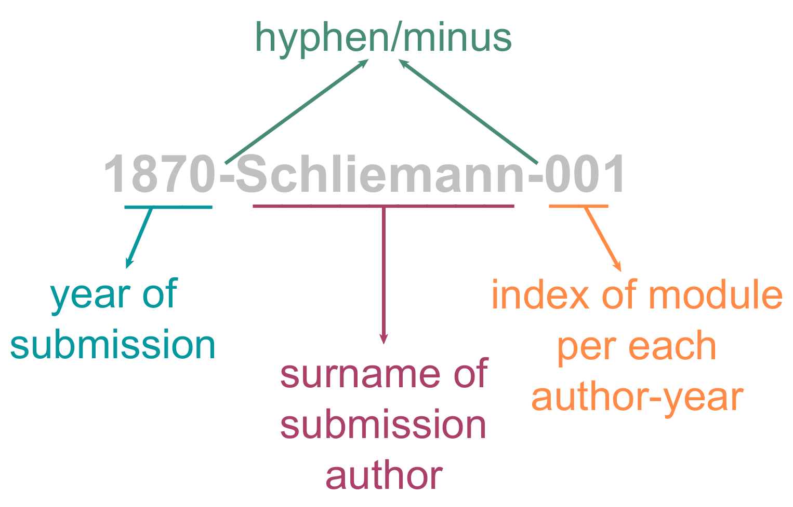

<head>
<meta name="viewport" content="width=device-width, initial-scale=1">
<style>
* {
  box-sizing: border-box;
}
/* Create two equal columns that floats next to each other */
.column {
  float: left;
  width: 50%;
  padding: 10px;
}
/* Clear floats after the columns */
.row:after {
  content: "";
  display: table;
  clear: both;
}
/* Responsive layout - makes the two columns stack on top of each other instead of next to each other */
@media screen and (max-width: 600px) {
  .column {
    width: 100%;
  }
}
/* Style the button */
.top-link {
  transition:       all .25s ease-in-out;
  position:         fixed;
  bottom:           0;
  right:            0;
  display:          inline-flex;
  color:            #000000;
  cursor:           pointer;
  align-items:      center;
  justify-content:  center;
  margin:           0 2em 2em 0;
  border-radius:    50%;
  padding:          .25em;
  width:            2em;
  height:           2em;
  background-color: #F8F8F8;
}
</style>
</head>

<a class="top-link hide" href="#top" style="font-size: 200%;">↑</a>
<a name="top"></a>

# Guide for module submission<!-- omit from toc --> 
- [Preparation](#preparation)
  - [NASSA membership](#nassa-membership)
  - [GitHub](#github)
  - [Fork the library repository](#fork-the-library-repository)
  - [*Workflow A*: using GitHub Web interface only](#workflow-a-using-github-web-interface-only)
  - [*Workflow B*: using local copy of repository](#workflow-b-using-local-copy-of-repository)
  - [Creating a new branch](#creating-a-new-branch)
- [Creating a module](#creating-a-module)
  - [Overview](#overview)
  - [Templates and module examples](#templates-and-module-examples)
  - [Naming the module directory](#naming-the-module-directory)
  - [Code editors or IDEs (optional)](#code-editors-or-ides-optional)
  - [Planning a directory structure](#planning-a-directory-structure)
  - [Implementation(s)](#implementations)
    - [Code style](#code-style)
  - [".gitignore"](#gitignore)
  - [License](#license)
  - [references.bib](#referencesbib)
  - [CHANGELOG.md](#changelogmd)
  - [NASSA.yml (metadata)](#nassayml-metadata)
    - [Identification and technical details:](#identification-and-technical-details)
    - [Authorship:](#authorship)
    - [Keywords:](#keywords)
    - [Input and output](#input-and-output)
    - [Bibliographic information](#bibliographic-information)
  - [README.md](#readmemd)
  - [Other documentation files](#other-documentation-files)
  - [Validation (workflow B)](#validation-workflow-b)
- [Submitting a module](#submitting-a-module)
  - [Commit the new module directory to branch](#commit-the-new-module-directory-to-branch)
  - [Create Pull Request](#create-pull-request)
- [Automatic check](#automatic-check)
- [Reviewing a module](#reviewing-a-module)
  - [Merging and final checks](#merging-and-final-checks)

---
## Preparation

### NASSA membership

A submission author might want to become a NASSA member, which is free and only requires registration by contacting our [core team or to the community (Google Group)](https://archaeology-abm.github.io/NASSA-hub/about-us.html). It will give direct access to the network with all its perks, including an easier developer workflow when contributing to NASSA's repositories.

### GitHub

GitHub hosts the library repository, which uses Git as the version control software. All submissions must be managed through GitHub and require a minimum knowledge of Git.

Submission authors who are not already GitHub users can choose any means to learn about these tools, but we recommend consulting [GitHub Documentation](https://docs.github.com/). For a more general introduction to Git and GitHub, we also recommend [SSLA's "How to navigate the coding archaeology world: An introduction to scientific co-creation using Git and Github"](https://github.com/sslarch/caa2022_GitGitHub_workshop).

Create a personal account in GitHub by going to [https://github.com](https://github.com) select "Sign up", and follow the instructions.

Once a GitHub account is set up, there are a few further preparation steps that are required depending on the workflow chosen to create and manage modules.

### Fork the library repository

All contributors should create a "fork" of the library repository (i.e. an online parallel copy associated to the author GitHub account that can be easily synchronised with NASSA's original version). Go to the library's repository main page on GitHub ([https://github.com/Archaeology-ABM/NASSA-modules](https://github.com/Archaeology-ABM/NASSA-modules)) and click on "Fork" in the top right area of the page. Accept the default settings by clicking "Create fork". You should now find yourself in a new repository "NASSA-modules" with your GitHub user name as the prefix (i.e. "www.github.com/user-name/NASSA-modules").

### *Workflow A*: using GitHub Web interface only

Virtually every task can be perform in a repository using only a GitHub account and your Web browser. Thus, if you plan to make only a few contributions to the library, we recommend this option. Check the tutorial in [GitHub Docs > Get started > Quickstart > Hello World](https://docs.github.com/en/get-started/quickstart/hello-world), if you are new to GitHub Web interface.

### *Workflow B*: using local copy of repository

Having a version of the library downloaded (cloned) and synchronised in a local disc allows for editing and testing of files and code before committing any changes to the repository online. This workflow is recommended for those who plan to make many contributions (modules, updates of modules, maintenance tasks).

Taking this workflow require the following extra steps:  
1. **Install and set up Git**. Follow the instructions given in [GitHub Docs > Get started > Quickstart > Set up Git](https://docs.github.com/en/get-started/quickstart/set-up-git).  
2. **Install GitHub Desktop** (optional). GitHub offers a graphical interface for managing Git/GitHub, as an alternative or complementary tool to the command line. Consult the instructions given in [GitHub Docs > GitHub Desktop](https://docs.github.com/en/desktop/installing-and-configuring-github-desktop/overview/getting-started-with-github-desktop).
3. **Clone the library repository**. *If using GitHub Desktop*: On your forked version of the repository, click on "<> Code" (green button). Click on "Open with GitHub Desktop" which will open the application (browser permission required) with a pop-up window entitled "Clone a repository". Notice that this window will already include the repository URL. Choose the directory where to clone the files ("local path") and click on "Clone". *If using Git command lines*: Follow the instructions in [GitHub Docs > Repositories > Create & manage repositories > Cloning a repository](https://docs.github.com/en/repositories/creating-and-managing-repositories/cloning-a-repository).

### Creating a new branch

To facilitate the management of submissions, we encourage all changes involving a module to be carried out inside a new branch.

A *branch*, in Git terms, is a series of versions of a repository where changes are contained until finally accepted and merged back into the main series. A Git branch is unlike a literal tree branch but somewhat similar to a river branch catching different sediments and returning to the main flow or a thread that diverges from a fabric, receives several knots, and is woven together again.

Please, name the new branch with your surname to facilitate the management later. You could use something like `yoursurname-modules` so that you can reuse it every time you submit a module.

**_Workflow A_**: using GitHub Web interface:  
> Follow the instruction in [GitHub Docs > Pull requests > Collaborate with pull requests > Propose changes > Creating and deleting branches within your repository](https://docs.github.com/en/pull-requests/collaborating-with-pull-requests/proposing-changes-to-your-work-with-pull-requests/creating-and-deleting-branches-within-your-repository).

**_Workflow B_**: using local copy:  
> Follow the instruction in:
>1. [GitHub Docs > GitHub Desktop > Make changes in a branch > Managing Branches](https://docs.github.com/en/desktop/contributing-and-collaborating-using-github-desktop/making-changes-in-a-branch/managing-branches) (GitHub Desktop)
>2. [GitHub Docs > Quickstart > Contributing to projects > Creating a branch to work on](https://docs.github.com/en/get-started/quickstart/contributing-to-projects) (Git command lines).

Once a branch has been created, make sure that it is selected, instead of "main", whenever changes are committed (see further below).

Finally, you can "publish" the branch by either following the highlighted suggestion in GitHub Desktop or using command lines (**_Workflow B_**).

---
## Creating a module

### Overview

<div class="row">
  <div class="column">
    <p>
    A NASSA module is a <strong>program specification of an algorithm and its implementation</strong> in one or more programming languages, accompanied by its unique <strong>metadata</strong> and <strong>documentation</strong> designed to facilitate its long-term and community-wide understanding and reuse.
    </p>
    <p>
    Therefore, there are four essential aspects that must be considered by authors:
    <ul>
    <li>File structure: the content of a module must be structured in a certain way in order to be recognised by users and our automated operations.</li>
    <li>Implementation(s): we encourage the addition of multiple implementations within a module. However these must be kept separated in subdirectories named accordingly to the programming language used.</li>
    <li>Documentation: we allow for different layers of documentation, which are desired but not strictly required for acceptance.</li>
    <li>Metadata: a minimal set of files are required, which hold information on various aspects that must be tracked by NASSA members and users (e.g., authorship, minimal description, license).</li>
    </ul>
    </p>
  </div>
  <div class="column">
    
  </div>
</div>

### Templates and module examples

To keep the preparation of a new module as short and simple as possible, we strongly recommend using module templates. The NASSA community aims to offer a variety of templates for types of modules, levels of documentation and programming languages. Feel free to use any of the modules already in the library as templates, if it better suits your module. Once you have already created and submitted a module, you may also use it as your own template for creating other modules. We have also included a dummy example of a module, ["1870-Schliemann-001"](https://archaeology-abm.github.io/NASSA-modules/1870-Schliemann-001.html), which will be referenced throughout this guide. Notice that it was carefully prepared before computational archaeology was even a thing!

Visit the [library Web interface](https://archaeology-abm.github.io/NASSA-modules/index.html), search for the term "TEMPLATE" and select the one most adequate for your type of module. Download the template directory by at its view page. The most basic and generic template is ["YEAR-Surname-000"](https://archaeology-abm.github.io/NASSA-modules/0000-NASSA-001-TEMPLATE.html). Once the file has been downloaded, uncompress the module folder into a directory of your choice.

When working locally (**_Workflow B_**), you can simply duplicate a module as a template, rename it, and then delete, create or modify files accordingly.  

### Naming the module directory

The module directory must be named with the **module's unique identifier**, following the structure:

<div class="row">
  <div class="column">
    <ol>
        <li><b>Year of submission</b>. The year when the module is submitted to the library repository, never to be changed, even in future versions of the module.</li>
        <li><b>Submission author surname</b>. The surname of the submission author as a single word spelling and with no special characters. This is strictly for identification purposes, while the module authorship  credits are later detailed, inside NASSA.yml.</li>
        <li><b>Index number per each author-year</b>. A unique three-digit number based on how many modules the same author has submitted during a single year. The number is strictly for identification purposes and must be set following an ascending order (i.e., from 001 to 999).</li>
    </ol>
  </div>
  <div class="column">
    
  </div>
</div>

Each element is separated by a hyphen or minus sign ("-"; [Unicode specification](https://www.fileformat.info/info/unicode/char/2d/index.htm)).

---
### Code editors or IDEs (optional)

We recommend using a **code editor** or an **integrated development environment** (IDE) to create and edit most module files.

When working locally on the library (**workflow B**), many code editors and IDE can open a module directory as a "project" or "working directory", which will help ensure no accidental changes are made outside the new module . Using such software will make editing more agile (e.g., autocomplete, syntax highlighting), help identify errors, and ease the use of command lines. Most will also offer seamless management of version control with Git.

There are many options, but a good example is [Visual Studio Code](https://code.visualstudio.com/) by Microsoft or [RStudio](https://posit.co/download/rstudio-desktop/) by Posit.

---

### Planning a directory structure

A minimal set of files must be present and structured in a specific manner inside the directory to be considered a NASSA module. These files must be named following exactly [NASSA schema](https://github.com/Archaeology-ABM/NASSA-schema). The minimal set is the following:

```
YYYY-SURNAME-001 (module root)
│   
└───<IMPLEMENTATION LANGUAGE>
    └   moduleShortTitle.<LANGUAGE EXTENSION>
  CHANGELOG.md
  LICENSE
  NASSA.yml
  README.md
  references.bib
```

All module templates will already contain the minimum set of files, which should then be edited according to your module's specifications. Other modules already integrated to the library can be also observed as examples.

Of course, you should add all other files related specifically to your module, typically placing then inside implementation or documentation folders. As an example, the following structure is used in Schliemann's dummy module, which is implemented in NetLogo and Python:

```
1870-Schliemann-001 (module root)
|
└───documentation
|   └  designDetails.md
|   └  tableOfContents.md
│   
└───netlogo_implementation
|   └documentation
|   |  └   instructions.md
|   |  └   tableOfContents.md
|   |  └   TroyDestroy interface.png
|   |  └   TroyDestroy_agents interface.png
│   └   TroyDestroy.nlogo
|   └   TroyDestroy_agents.nlogo
|
└───python_implementation
    └documentation
    |  └   tableOfContents.md
    └   Army.py
    └   City.py
    └   demonstration.ipynb
    └   main.py

  .gitignore
  CHANGELOG.md
  LICENSE
  NASSA.yml
  README.md
  references.bib
```

### Implementation(s)

NASSA modules are pieces of simulation models that are ultimately algorithms, i.e., finite sequences of formal instructions that receive an input and generate an output. Each implementation in a NASSA module should produce the intended sequences (i.e., represent the general program specification) while keeping all steps the more explicit and intelligible as possible.

For example, in "1870-Schliemann-001", the program specification reads:

>This module takes the strength of two armies, one aggressor and another defender, and calculates the level of destruction of the defenders' city. The destructive effect over the defenders' city is proportional to the two contending strengths and a constant rate per unit of strength of the aggressor matched by the defender.

Thus, one NetLogo implementation ("1870-Schliemann-001/netlogo_implementation/TroyDestroy.nlogo") could be:

```
globals
[
  ;;; input
  greeks-strength trojans-strength
  destruction-rate
  init-troy-health

  ;;; output
  troy-health
]

to setup

  ;;; load input from interface
  set greeks-strength par_greeks-strength
  set trojans-strength par_trojans-strength
  set destruction-rate par_destruction-rate

  set init-troy-health 100

  set troy-health init-troy-health

end

to resolve-trojan-war

  ;;; Resolve the destruction level based on army strengths and a destruction rate and update city health
  set troy-health (get-effect-of-war troy-health greeks-strength trojans-strength destruction-rate)

end

to-report get-effect-of-war [ cityHealth aggressorStrength defenderStrength destructionRate ]

  ;;; Return the destruction level based on army strengths and a destruction rate
  report max (list 0 (cityHealth - destructionRate * (aggressorStrength ^ 2) / defenderStrength))

end

```

Schliemann was feeling generous and decided to also offer another version, properly agent-based, that fits the same specification ("1870-Schliemann-001/netlogo_implementation/TroyDestroy_agents.nlogo"):

```
globals
[
  ;;; input
  greeks-strength trojans-strength
  destruction-rate
  init-troy-health

  ;;; output
  troy-health
]

breed [ cities city ]
breed [ armies army ]

cities-own [ name health ]

armies-own [ name strength ]

to setup

  clear-all

  ;;; load input from interface
  set greeks-strength par_greeks-strength
  set trojans-strength par_trojans-strength
  set destruction-rate par_destruction-rate

  set init-troy-health 100

  ;;; create agents
  create-cities 1
  [
    set name "Troy"
    set health init-troy-health
  ]

  create-armies 1
  [
    set name "Greeks"
    set strength par_greeks-strength
  ]

  create-armies 1
  [
    set name "Trojans"
    set strength par_trojans-strength
  ]

  reset-ticks

end

to resolve-trojan-war

  ;;; Resolve the destruction level based on army strengths and a destruction rate and update city health
  ask cities with [ name = "Troy" ]
  [
    let greeks-strength-total sum [strength] of armies with [ name = "Greeks" ]
    let trojans-strength-total sum [strength] of armies with [ name = "Trojans" ]
    set health (get-effect-of-war health greeks-strength-total trojans-strength-total destruction-rate)
  ]

end

to-report get-effect-of-war [ cityHealth aggressorStrength defenderStrength destructionRate ]

  ;;; Return the destruction level based on army strengths and a destruction rate
  report max (list 0 (cityHealth - destructionRate * (aggressorStrength ^ 2) / (defenderStrength)))

end
```

A few colleagues really pressed him for a Python 3 implementation, so he included the following inside "python_implementation":

"City.py":

```{Python}
class City:
    """Class representing the city under siege"""

    def __init__(self, health):
        self.health = health

    def get_effect_of_war(self, aggressor_strength, defender_strength, destruction_rate):
        """Return the destruction level based on army strengths and a destruction rate"""
        return max(0, (self.health - destruction_rate * (aggressor_strength ** 2) / (defender_strength)))
    
    def resolve_war(self, aggressor_strength, defender_strength, destruction_rate):
        """Resolve the destruction level based on army strengths and a destruction rate and update city health"""
        self.health = self.get_effect_of_war(aggressor_strength, defender_strength, destruction_rate)

```

"Army.py":

```{Python}
class Army:
    """Class representing an army"""

    def __init__(self, strength):
        self.strength = strength
```

"main.py":

```{Python}
"""Python implementation of TroyDestroy"""
from Army import Army
from City import City

# input
GREEKS_STRENGTH = 100
TROJANS_STRENGTH = 50
DESTRUCTION_RATE = 0.42

TROY_HEALTH = 100

# initialise
greeks = Army(GREEKS_STRENGTH)

trojans = Army(TROJANS_STRENGTH)

troy = City(TROY_HEALTH)

print("Troy health before war: " + str(troy.health))

# algorithm execution
troy.resolve_war(GREEKS_STRENGTH, TROJANS_STRENGTH, DESTRUCTION_RATE)

# output
print("Troy health after war: " + str(troy.health))

```

<strong>All implementations must fit the generic specification of the module.</strong> Each implementation language included in the module must have at least have one version each that returns the same output for the a given input. Other versions within each implementation, that offer extensions of the core functionality, may escape this requirement according to the nature of the alternative design.

#### Code style

Any final code attached to the submission must be functional and readable. NASSA recommends authors are attentive to the following points:

**Naming**. Use consistent conventions to differentiate variables, parameters, and functions. Enforce exact, self-explanatory names, and avoid names imitating mathematical annotations. Exceptions could be made by compensating name simplification with more detailed commentary and documentation.

**Single-responsibility principle**. The code should be modular to the best of the authors' (programming) ability, mainly if the contribution is relatively complex (e.g., if the module involves several types of entities or represents a process in several steps). See more information at [Wikipedia](https://en.wikipedia.org/wiki/Single-responsibility_principle).

**No magic numbers**. Magic numbers occur in code without an explicit meaning and are not adjustable without altering the code. They should preferably be replaced by named variables to be set during initialisation, even if kept as constants. (https://en.wikipedia.org/wiki/Magic_number_(programming))

**Exposed inputs and outputs**. All variables named as either input or output of the module must be easily reachable in code from outside the module to enable the module's plug-and-play capability (i.e. usable without internal editing).

**Minimise dependencies**. Authors should avoid using third-party libraries, packages, etc., as much as possible. It is crucial to avoid any software that is relatively hard to obtain or set up. Dependencies are always a risk for reproducibility and code sustainability in the long run.

**Commentary in code**. Be repetitive and explain language-specific terms (not commonly known or easily searchable) whenever possible. Expand information whenever relevant, e.g., offering a source (preferably a stable URL) or explaining the logic behind a hardcoded or suggested parameter value. Add full references, with URL if available, of the sources used to inform the design of an algorithm or set parameter values. If there are any code fragments "commented-out", use a clear and consistent way to differentiate these from true commentary.

### ".gitignore"

You might want Git/GitHub to ignore certain files or type of files, depending on the programming language used by the module or if there are files generated by demonstrations, etc. In this case, a `.gitignore` file should be added in the main directory of your module, specifying what should be ignored.

See more about this kind of file at [Git documentation](https://git-scm.com/docs/gitignore). Also GitHub offers an an extensive list of suggestions [here](https://github.com/github/gitignore).

For example, "1870-Schliemann-001" includes a Python implementation that will probably be run in place by users and possibly generate cache data. For this reason, its ".gitignore" file reads: 

```
__pycache__/
*.pyc
```

### License

Choose an open license stating the permissions for the module's use, reproduction, and modification. NASSA recommends either [MIT](http://www.opensource.org/licenses/MIT) or [GPL-3](https://www.gnu.org/licenses/gpl-3.0.en.html) (see also [GitHub’s choosealicense.com](https://choosealicense.com/)).

The license text must be included as a separate file named "LICENSE" (American English spelling) in the root directory. In some types of implementation, when the entire code is present in a single file (e.g., NetLogo), we recommend adding a short mention of the license at the start or end of the source code file.

### references.bib

A BibTex file named "references.bib" is placed in the root directory of the module and should contain all references mentioned in the metadata ("NASSA.yml"). BibTeX files can be generated using reference management software (e.g. Zotero).

### CHANGELOG.md

All submitted changes in the module files must be reflected in their version number and noted in the log file ("CHANGELOG.txt").

NASSA encourages the use of [semantic versioning](https://semver.org/), whenever applicable, according to which different versions are tagged following the convention *vX.Y.Z*, where X, Y and Z are positive integers that increase when a new version involves major, minor and patch (correction) changes. Changes to the module metadata, such as the correction of typos, wording adjustment, and author data update, are generally considered at the lowest level.

### NASSA.yml (metadata)

Metadata is contained in the "NASSA.yml" file, placed in the module's root directory, as exemplified in the templates.

To learn more about the YAML format, consult the [language website](https://yaml.org/), [Wikipedia entry](https://en.wikipedia.org/wiki/YAML), or any of the many tutorials available on the Web.

You may consult the detailed specifications of each field in the [NASSA schema repository](https://github.com/Archaeology-ABM/NASSA-schema/blob/main/README.md#nassayml-fields) ([JSON file](https://github.com/Archaeology-ABM/NASSA-schema/blob/main/nassa-schema.json)).

Notice that the order in which the fields are added to this file will not change its validity as module (it will remain machine-readable). We recommend generally following the order given in NASSA schema and in the templates, to facilitate human readability. However this default order might suffer changes in the future.

The fields in "NASSA.yml" are:

#### Identification and technical details:

- **id**: Module identification number. Assigned when opening a submission.
- **nassaVersion**: Latest version of the NASSA schema that applies to this module (NASSA.yml fields, directory and file structure).
- **moduleType**: Whether a algorithm or a submodel (contain modules).
- **title**: Module name or title. It must include a useful description of module.
- **moduleVersion**: Current version identifier. Defaults to "1.0.0" and should increase after every update.

From the template "YEAR-Surname-000/NASSA.yml":
```
id: YEAR-Surname-000
nassaVersion: 0.5.0
moduleType: Algorithm
title: (TEMPLATE) Module name or title including a useful description of module. Max. 100 characters.
moduleVersion: 1.0.0
```

For our dummy example ("1870-Schliemann-001/NASSA.yml"):
```
id: 1870-Schliemann-001
nassaVersion: 0.5.0
moduleType: Algorithm
title: (DUMMY EXAMPLE) TroyDestroy. Bronze Age siege and its destructive effect on settlement
moduleVersion: 1.0.0
```

...

- **license**: Software license for the code in this module.
- **lastUpdateDate**: Date of the last update submitted.
- **description**: Description of what the module does. It should expand the information already given in the name/title.
- **relatedModules**: List of modules (ids) this one is related to (similar, depending on, etc.).

From the template "YEAR-Surname-000/NASSA.yml":
```
lastUpdateDate: 1983-04-18
description: >
  Description of what the module does. It should expand the information already given in the name/title.
relatedModules: [ 0000-NASSA-002-TEMPLATE ]
...
license: MIT
```

For our dummy example ("1870-Schliemann-001/NASSA.yml"):
```
lastUpdateDate: 1871-10-20
description: >
  This module takes the strength of two armies, one aggressor and another defender, and calculates the level of destruction of the defenders' city. The destructive effect over the defenders' city is proportional to the two contending strengths and a constant rate per unit of strength of the aggressor matched by the defender.
relatedModules: [ 1874-NASSA-001 ]
...
license: MIT
```

...

- **implementations**: List of implementations in different programming languages.
  - **language**: Programming language.
  - **softwareDependencies**: Listing any software (libraries, packages, etc), specifying the release version, on which the module implementation relies to properly function.
- **docsDir**: Relative path to the directory containing general module documentation.

From the template "YEAR-Surname-000/NASSA.yml":
```
implementations:
  - language: NetLogo
    softwareDependencies:
      - language/software version x.x.x
      - extension version
docsDir: documentation/
```

For our dummy example ("1870-Schliemann-001/NASSA.yml"):
```
implementations:
  - language: NetLogo
    softwareDependencies:
      - NetLogo >= v6.1.1
      - gis (NetLogo extension)
  - language: Python
    softwareDependencies: 
      - Python >= v.3.9 
      - math (Python module)
      - random (Python module)
docsDir: documentation/
```

#### Authorship:

- **contributors**: List of contributors to the module.
  - **roles**: How this author contributed to the module (see "Authorship" below).
  - **name**: Full name of a contributor.
  - **email**: Stable email of a contributor.
  - **orcid**: ORCID number of a contributor.

Authors are considered in relation to their roles (Author, Compiler, Contributor, Copyright Holder, Creator, Thesis Advisor, Translator; see definitions [here](https://journal.r-project.org/archive/2012-1/RJournal_2012-1_Hornik~et~al.pdf)). A module must have at least one person listed as an "Author", "Copyright Holder" and "Creator", typically the person preparing and managing the submission, whose surname is represented in the module ID. A submission author, who is not directly responsible for the implementation code, should retain the abovementioned roles and name at least one additional author with an "Author" and "Copyright Holder" role. Later code modifications and documentation modifications can be acknowledged under the "Contributor" role. Individuals involved in formulating the algorithm but not creating the module may be acknowledged as "Author" and "Copyright Holder".

From the template "YEAR-Surname-000/NASSA.yml":
```
contributors:
 - name: Surname, Name (with no accent marks, first upper-case letters, and surname matching the id and root directory name)
   roles: [ "Author", "Compiler", "Contributor", "Copyright Holder", "Creator", "Thesis Advisor", "Translator" ]
   email: nassa@email.org
   orcid: 0000-0002-1825-0097
```

For our dummy example ("1870-Schliemann-001/NASSA.yml"):
```
contributors:
 - name: Schliemann, Heinrich
   roles: [ "Author", "Copyright Holder" ]
   email: schliemann@email.org
 - name: Angourakis, Andreas
   roles: [ "Author", "Copyright Holder", "Creator" ]
   email: andros.spica@gmail.com
   orcid: 0000-0002-9946-8142
```

#### Keywords:

- **domainKeywords**: Domain-related keywords.
  - **subjects**: Subject keyword(s).
  - **regions**: Region keyword(s).
  - **periods**: Period keyword(s).
- **modellingKeywords**: Modelling-related keyword(s). Using NASSA schema specifications.
- **programmingKeywords**: Programming-related keyword(s). Using NASSA schema specifications.

Keywords are freestyle categories, open to future standardisation to avoid duplicates. NASSA recommends using terms already established in ontologies elsewhere (e.g., [EHRAF](https://ehrafworldcultures.yale.edu/ehrafe/majorSubjects.do) for subjects, [GeoNames](http://www.geonames.org/) for regions, [perio.do](https://perio.do/en/) for periods).

From the template "YEAR-Surname-000/NASSA.yml":

```
domainKeywords:
  regions: 
    - Global
  periods: 
    - Palaeolithic
  subjects: 
    - diffusion
modellingKeywords:
  - agent initialisation
  - grid initialisation
  - time initialisation
programmingKeywords:
  - Functional
  - Point-free style
```

For our dummy example ("1870-Schliemann-001/NASSA.yml"):
```
domainKeywords:
  regions: 
    - Global
    - Eastern Mediterranean
  periods: 
    - Bronze Age
    - Mycenaean
  subjects: 
    - war
modellingKeywords:
  - agent
  - calculation
programmingKeywords:
  - Functional
  - Object-oriented
```

#### Input and output

To facilitate later use and improve the visualisation of the module functionality, NASSA requests that all input and output variables and parameters are listed and shortly described.

- **inputs**: List of inputs required by the module. Create entries for each of the variables that can or should be given/set externally, so that the module can work.
  - **name**: Parameter/variable/file name in the module.
  - **type**: Parameter/variable/file type. Use the programming language specific type.
  - **unit**: Parameter/variable unit of measurement, if applicable.
  - **description**: Parameter/variable/file description. Meaning, data structure, or any other relevant information for the procurement and preparation of the input.
- **outputs**: List of outputs generated by the module. Create entries for each of the variables that are suggested as outputs. Ideally, the list should also include any module variable that can be read externally and is the product of module mechanisms (i.e., not equal to the inputs).
  - **name**: Parameter/variable/file name in the module.
  - **type**: Parameter/variable/file type. Use the programming language specific type.
  - **unit**: Parameter/variable unit of measurement, if applicable.
  - **description**: Parameter/variable/file description. Meaning, data structure, or any other relevant information for the procurement and preparation of the input.

From the template "YEAR-Surname-000/NASSA.yml":
```
inputs:
  - name: Parameter/variable/file name in the module.
    type: Parameter/variable/file type. Use the programming language specific type.
    unit: Parameter/variable unit of measurement, if applicable.
    description: Parameter/variable/file description. Meaning, data structure, or any other relevant information for the procurement and preparation of the input.
outputs:
  - name: Variable/object name in the module.
    type: Variable/object type. Use the programming language specific type.
    unit: Variable/object unit of measurement, if applicable.
    description: Variable/object description. Meaning, data structure, or any other relevant information for data analysis and interpretation or the use of the output as input in another module.
```

For our dummy example ("1870-Schliemann-001/NASSA.yml"):
```
inputs:
  - name: greeks-strength, GREEKS_STRENGTH
    type: integer
    unit: army strength
    description: The strength of the Greek army (attackers), measured in number of soldiers, units, etc.
  - name: trojans-strength, TROJANS_STRENGTH
    type: integer
    unit: army strength
    description: The strength of the Trojan army (defenders), measured in number of soldiers, units, etc.
  - name: destruction-rate, DESTRUCTION_RATE
    type: float
    unit: city health / army strength
    description: The rate of destruction per unit of attacker strength
  - name: init-troy-health, TROY_HEALTH
    type: float
    unit: city health
    description: The general state of the defenders city, measured in population, structures, etc.
outputs:
  - name: troy-health, health, City.health
    type: float
    unit: city health
    description: The general state of the defenders city, measured in population, structures, etc.
```

#### Bibliographic information

Explicit mention of BibTex ids conrresponding to the references in "references.bib".

- **references**: Literature references.
  - **moduleReferences**: References that describe and explain the module, any of its parts, or its original use in a model. This includes public repositories holding models that include the module.
  - **useExampleReferences**: References citing, describing, or using the module, after it has been published in the NASSA library.

From the template "YEAR-Surname-000/NASSA.yml":

```
references:
  moduleReferences: [ Epstein2008 ]
  useExampleReferences: [ romanowska_agent-based_2021, Epstein2008 ]
```

For our dummy example ("1870-Schliemann-001/NASSA.yml"):
```
references:
  moduleReferences: [ homers-iliad ]
```

### README.md

The most generic documentation file is "README.md", which aims to present the module with a brief overview and is assumed to be the users' first contact with the module. It is written in GitHub-flavoured [markdown](https://www.markdownguide.org/) and may include images and external links.

The following section structure must be kept:

```
# Module name  
Authors' full name  

Description  

## License

## Further information
```

In "Further information", we recommend the display of any images included as part of the module documentation, such as diagrams, screenshots, output graphs in demonstrations, etc. Consult other modules as examples.

In case of "1870-Schliemann-001", no significant image is offer to illustrate the algorithm, so the authors chose to display a Wikimedia Commons image related to the subject to make the README file more memorable:

```
# (DUMMY EXAMPLE) TroyDestroy. Bronze Age siege and its destructive effect on settlement

*by Heinrich "Dummy" Schliemann* (NASSA submission :rocket:)

This module takes the strength of two armies, one aggressor and another defender, and calculates the level of destruction of the defenders' city. The destructive effect over the defenders' city is proportional to the two contending strengths and a constant rate per unit of strength of the aggressor matched by the defender.

## License

**MIT**

## References

Homer. 1865. The Iliad of Homer. J. Murray (trad.).

## Further information

<a title="Unknown Corinthian pottery maker BCE, Public domain, via Wikimedia Commons" href="https://commons.wikimedia.org/wiki/File:Corinthian_aryballos_depicting_the_trojan_war_from_1887_jahrbuchdeskaiserich_1200x500.jpg"></a>

This model is a algorithm implemented in NetLogo and Python 3. Disclaimer: the code might require updates since it was written in the 19th century.

Overview of the algorithm:

$$warEffect=-destructionRate*\frac{(attackerStrength)^2}{defenderStrength} $$

See full list of documentation resources in [`documentation`](documentation/tableOfContents.md).

```

### Other documentation files

Although not a strict requirement for acceptance, module should aspire to include a minimal set of files dedicated to documentation. Modules offering more documentation materials will be significantly more visible and usable by the community.

Because modules are both program specifications and implementations, we recommend that documentation is prepared at two levels:

- A generic understanding of what the program does and its entities, variables, parameters, etc, as well as any reference or scientific argument to contextualise its design. General documentation will typically involve infographics, diagrams, and text descriptions. We recommend storing the files holding this type of documentation inside a subdirectory directly in the module's root directory (e.g., `1870-Schliemann-001/documentation/`).

- A description of the terms and design of a single implementation, including practical instructions and specific terminology. This should also include instructions on compiling and running the respective code, if necessary. We recommend storing these files inside the subdirectory with the corresponding implementation (e.g., `1870-Schliemann-001/python_implementation/documentation/`). Some examples of language-specific documentation materials are:  
  - **Set up instructions**. Instructions on compiling and running the code. This is more relevant when using general-purpose programming languages or relying on specific libraries or external software. 
  - **User reference manual**. Variable and methods/functions lists, entity definitions, etc.  
  - **Screenshots** of graphical interface or output.  
  - **Pseudocode**. Representation of code as a sequence of logic steps (i.e., algorithm), using free-text or mathematical notation, or using graphical resources, be it formal (e.g., UML) or informal (e.g., infographics).  
  - **ODD or similar**, when submitting modules of the type "submodel". To know more about ODD, see Grimm et al. 2013.  
  - **Demostrations**. A step-by-step demonstration of the module use and outputs, combining explanations in text and code fragments, typically in a interactive notebook format (e.g., .ipynb, .rmd).

>Grimm, V., Polhill, G., & Touza, J. (2013). Documenting Social Simulation Models: The ODD Protocol as a Standard. In B. Edmonds & R. Meyer (Eds.), Simulating Social Complexity: A Handbook (pp. 117–133). Springer. https://doi.org/10.1007/978-3-540-93813-2_7

To boost the visibility of documentation files, we recommend that authors create a markdown file at both general and implementation levels to present a list of the documentation files (e.g., tableOfContents.md), with brief descriptions and links (relative paths) to the respective files. Such a file can then be linked from README.md.

See examples of how to do it in the templates offered in the library.

In "1870-Schliemann-001", notice how an instruction was included for the NetLogo implementation, a demonstration (.ipynb) for the Python implementation, and a design details file to explain the algorithm in more general terms:

```
1870-Schliemann-001 (module root)
|
└───documentation
|   └  designDetails.md
|   └  tableOfContents.md
│   
└───netlogo_implementation
|   └documentation
|   |  └   instructions.md
|   |  └   tableOfContents.md
|   |  └   TroyDestroy interface.png
|   |  └   TroyDestroy_agents interface.png
│   └   TroyDestroy.nlogo
|   └   TroyDestroy_agents.nlogo
|
└───python_implementation
    └documentation
    |  └   tableOfContents.md
    └   Army.py
    └   City.py
    └   demonstration.ipynb
    └   main.py

  .gitignore
  CHANGELOG.md
  LICENSE
  NASSA.yml
  README.md
  references.bib
```

In this case, "README.md" links to "documentation/tableOfContents.md", which reads:

```
(DUMMY EXAMPLE) TroyDestroy. Bronze Age siege and its destructive effect on settlement
# General documentation
## Table of contents

- [`designDetails.md`](designDetails.md) : free format document describing the module process, beyond the level of implementation.
  
- [NetLogo implementation](/netlogo_implementation/documentation/tableOfContents.md) : documentation specific to the NetLogo implementation.
  
- [Python implementation](/python_implementation/documentation/tableOfContents.md) : documentation specific to the Python implementation.
```

Leading to "netlogo_implementation/documentation/tableOfContents.md":

```
(DUMMY EXAMPLE) TroyDestroy. Bronze Age siege and its destructive effect on settlement
# Documentation - NetLogo implementation
## Table of contents

- [`instructions.md`](instructions.md)

- [`TroyDestroy interface.png`](TroyDestroy%20interface.png)


- [`TroyDestroy_agents interface.png`](TroyDestroy_agents%20interface.png)


```

and to "python_implementation/documentation/tableOfContents.md":

```
(DUMMY EXAMPLE) TroyDestroy. Bronze Age siege and its destructive effect on settlement
# Documentation - Python implementation
## Table of contents

- [`demonstration.ipynb`](demonstration)

```

The golden rules in preparing documentation files here are "nothing is trivial enough to be mentioned" and "do not fear repeating yourself". The point is to facilitate the understanding of the module at different levels and for different backgrounds.

### Validation (workflow B)

If you are operating over a local copy of the library, you have the option of checking the integrity of your module, that is, if it has all files and metadata necessary for being processed in submission. This check will occur in GitHub after you create the Pull Request with your module (i.e. module submission).

To perform the check, go to [nassa-hs repository](https://github.com/Archaeology-ABM/nassa-hs) and follow the instructions in "README.md".

---
## Submitting a module

### Commit the new module directory to branch

In GitHub, navigate to the new branch of your copy of the NASSA library. This should be something like: "https://github.com/your-user-name/NASSA-modules/tree/name-of-your-branch". Click on "+" and select "Upload files". Upload the module folder, naming the commit as "module submission", and commit the changes. 

When working locally (workflow B), open the library directory of your new branch and copy the module folder to the library's root directory. Then create a commit named "module submission: moduleID" (e.g. "module submission: 1870-Schliemann-001").

Remember to publish the branch if you haven't done so already (GitHub Desktop will remind you).

### Create Pull Request

Once all module files have been committed to your branch, you can create a Pull Request. To facilitate the review and checking of modules, **do NOT commit more than one module per Pull Request**. If you have want to work on two or more submission at a time, do it in by containing each of them in a separate branch of your fork. 

In GitHub Web interface, any number of commits to your branch/fork will trigger a reminder with a green button "Compare & pull request". Alternatively, navigate to Pull requests tab on the top menu area and then "New pull request".

When working locally (**_Workflow B_**), GitHub Desktop will also remember you with a suggestion in the main area of the interface.

The next screen will allow you to name the Pull Request and write a description. If a single commit was done, the title of the Pull Request will be "module submission" with any description text you have added. If not, make sure the title is "module submission: moduleID" (e.g. "module submission: 1870-Schliemann-001").


Lower in this page, it will be listed all new changes of your branch/fork in relation to the main branch of the original NASSA library repository ("Archaeology-ABM/NASSA-modules").

On the side bar on the right, you may also request reviewers among colleagues, including anyone in the NASSA community, or GitHub users you know. By default, the Pull Request will be revised by at least one [core team](https://archaeology-abm.github.io/NASSA-hub/about-us.html).

You can save the Pull Request as a draft or submit it with the green button on the right "Create Pull Request".

## Automatic check

The NASSA library repository will execute the nassa-hs application for every new Pull Request to test if it complies with all minimum requirements. This will take a few seconds.

If you followed all required specifications in the [NASSA schema](https://github.com/Archaeology-ABM/NASSA-schema), particularly regarding the content of "NASSA.yml".

Do not panic if the check fails!


In most cases, the problem has a easy solution. When having a fail test, click on "Details". The next screen will show you in "Validation" the console printout of nassa-hs execution and accuse what was found missing.


 In our case, we realised that Schliemann (i.e. `.contributors[0]`) is a man of his time, thus still not having a valid ORCID. Shame!

 Despite the embarrassing situation, he decided to use a dummy ORCID (0000-0002-1825-0097) instead of creating one. Double shame!

 To solve the problem, go back to your Pull Request page and select the tab "Files changed". Click the three dots in the top right corner of the editor and select “Edit this file”. Make the changes and commit. Click on "Refresh", highlighted on the top, to see the changes integrated in the Pull Request. Go back to the "Conversation" tab and see if the automatic test is now passing. Repeat this process until it does.
 
 If you have any doubts in this stage or the problem is not clear from the printout of nassa-hs, write to one of the our [core team or to the community (Google Group)](https://archaeology-abm.github.io/NASSA-hub/about-us.html).

## Reviewing a module

One or more NASSA members will then review your module submission (Pull Request) and possibly suggest changes through either comments or modifications to the files as they are in the Pull Request.

Comments and changes can be assessed, rebutted, or accepted by the author who has submitted (created the Pull Request). For more information, see the [GitHub documentation]([#reviewing-a-module](https://docs.github.com/en/pull-requests/collaborating-with-pull-requests/reviewing-changes-in-pull-requests/reviewing-proposed-changes-in-a-pull-request)).

We expect everyone in the community to be fair and polite when reviewing modules. Modules do not need to be perfect and we do expect many submission will be later revised or expanded by the original authors or other new contributors. If the is a dispute between authors and a reviewer, or an author feels that a reviewer has been unfair, please contact our [core team](https://archaeology-abm.github.io/NASSA-hub/about-us.html).

Alternatively, if there are many hard or structural problems, authors may want cancel the Pull Request and prepare a new revised one. For this, click on "Close Pull Request" at the bottom of your Pull Request page. After the Pull Request is closed, you may perform the changes and repeat the steps for creating a new submission (Pull Request).

### Merging and final checks

If a module has passed all automatic tests and reviewers found no major issues, a core member will then merge the Pull Request and your module will became part of the NASSA library.

Beyond GitHub Web interface, you and others will be able to find your module in the [NASSA Library Web App](https://archaeology-abm.github.io/NASSA-modules/) and preview it with its own dedicated page (created automatically after the merge is done). It is time to promote it and cite it!
