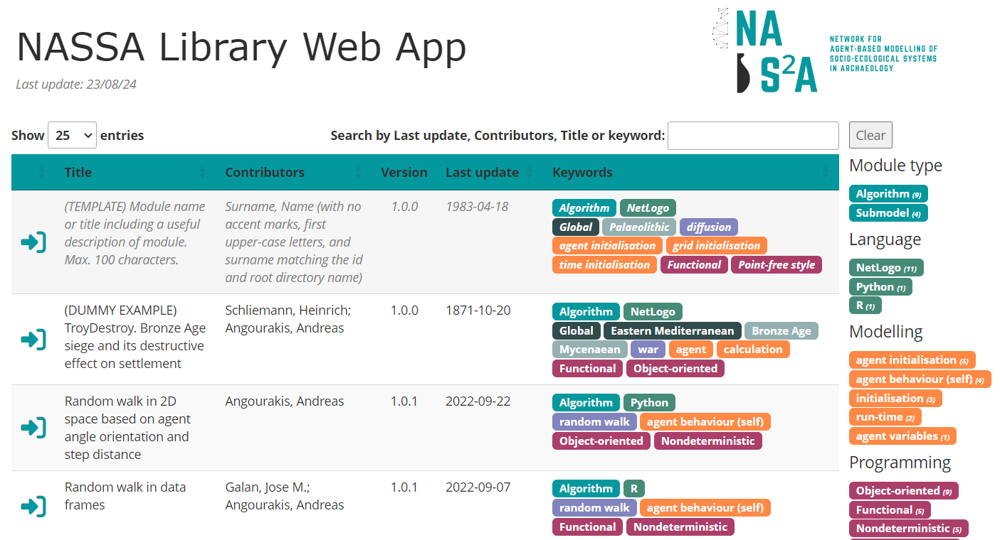

# NASSA library

The NASSA library is an **open-source** repository collecting **stable, version-controlled modules** to be used inside or in connection to **(agent-based) simulation models** that aim at representing **socio-ecological systems** and addressing **archaeological questions**.

NASSA provides a **standardised module format** ([NASSA-schema](https://github.com/Archaeology-ABM/NASSA-schema)) and encourages programming good practices, as well as a framework for the **review and curation of modules** using [GitHub code review feature](https://github.com/features/code-review).

Modules are **authored submissions**, individually **licensed** and **citable** as other academic publications. However, as a community resource, they remain open for **further development and revision** by the original author(s) or any contributor, under the curation of NASSA members.

<a href="https://archaeology-abm.github.io/NASSA-modules" style="color: #03989E;">
    <i style="font-size: 150%;">Browse modules using the NASSA library Web interface</i>
    
</a>

 

# What is a NASSA module?

  

    

    A NASSA module is a <strong>program specification and implementation</strong> in one or more programming languages, accompanied by its unique <strong>metadata</strong> and <strong>documentation</strong> designed to facilitate its long-term and community-wide understanding and reuse. All modules are ultimately <strong>algorithms</strong>, i.e., finite sequences of formal instructions that receive an <strong>input</strong> and generate an <strong>output</strong>. 
    

  

  

    
  

  

    

    The NASSA library schema classifies modules as <strong>algorithms</strong> only if their functionality is indivisible. Alternatively, modules are classified as <strong>submodels</strong> if they contain more than one algorithm that can be explicitly defined as separate modules.  
    

  

  

    
  

